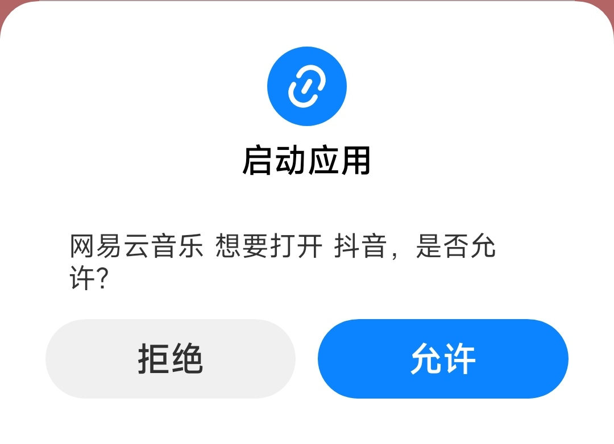

# MIUI WakePath 研究记录

设备环境：
- Redmi K30 5G
- Android 12
- MIUI 13.0.3
- Magisk root

## 已确认的数据库

主要文件：

```
/data/user/0/com.lbe.security.miui/databases/wake_path.db
/data/user/0/com.lbe.security.miui/databases/miui_ngen.db
```

均为 SQLite 3。

---

## StartActivityRuleList

### 跳转提示图

网易云 → 抖音首次触发 WakePath 时的系统询问提示：



表结构：

```sql
CREATE TABLE StartActivityRuleList(
_id INTEGER PRIMARY KEY AUTOINCREMENT,
callerPkgName TEXT,
calleePkgName TEXT,
userSettings TINYINT
)
```

目前实测：这个表控制应用 A -> B 的 WakePath 跳转询问记录。

测试案例：

```
com.chinatelecom.bestpayclient
    ->
com.ss.android.ugc.aweme
```

删除该行后，再次跳转会重新弹出 WakePath 询问。

SQL：

```sql
DELETE FROM StartActivityRuleList
WHERE callerPkgName='com.chinatelecom.bestpayclient'
AND calleePkgName='com.ss.android.ugc.aweme';
```

已确认：

```
翼支付 -> 抖音
网易云 -> 拼多多
```

点过允许后，StartActivityRuleList 中出现：

```
userSettings=0
```

但目前不能确定所有 MIUI 版本中 0/1 的固定含义，只能确认当前 MIUI 13.0.3 实测行为。

---

## WakePathWhiteList

表结构：

```sql
CREATE TABLE WakePathWhiteList(
_id INTEGER PRIMARY KEY AUTOINCREMENT,
PkgName TEXT,
userSettings TINYINT
)
```

实测发现它对应 MIUI 自启动管理中的：

“允许被其他应用唤醒”

不是应用 A -> B 跳转询问记录。

示例：

```
com.tencent.mm
com.tencent.mobileqq
com.miui.notes
```

删除微信白名单不会影响普通跳转提示。

---

## RuleListInfo

系统规则表：

```sql
CREATE TABLE RuleListInfo(
_id INTEGER PRIMARY KEY,
entryId TEXT,
actionExpress TEXT,
classNameExpress TEXT,
callerExpress TEXT,
calleeExpress TEXT,
wakeType TINYINT,
userSettings TINYINT
)
```

发现抖音支付相关规则：

```
9100||*|com.ss.android.ugc.aweme.cjpay.DyPayRooterActivity|*|com.ss.android.ugc.aweme|32|2
```

属于系统规则，不是用户允许记录。

---

## WakePathRejectedDetailInfo

结构：

```sql
CREATE TABLE WakePathRejectedDetailInfo(
callerPkgName TEXT,
calleePkgName TEXT,
wakeType TINYINT,
rejectTime TimeStamp,
rejectCount INTEGER
)
```

测试中未发现翼支付 -> 抖音拒绝记录。

---

## 当前结论

MIUI 13 WakePath 相关逻辑：

```
RuleListInfo
    系统规则

WakePathWhiteList
    应用级“允许被其他应用唤醒”

StartActivityRuleList
    用户对具体 A -> B 跳转的处理结果

WakePathRejectedDetailInfo
    拒绝记录
```

想让某个应用跳转关系重新弹询问：

删除 StartActivityRuleList 对应 caller/callee 即可。

例如：

```sql
DELETE FROM StartActivityRuleList
WHERE callerPkgName='A'
AND calleePkgName='B';
```

---

## 未完成问题

微信小程序广告：

```
广告页面 -> 微信 -> 小程序
```

目前观察到不会弹 WakePath。

原因可能是：

1. 实际只有广告应用 -> 微信一次启动；
2. 微信内部打开小程序，不经过 Android 应用间 WakePath；
3. 使用微信 scheme / WebView 调起。

需要继续抓 logcat 确认真正 caller。
